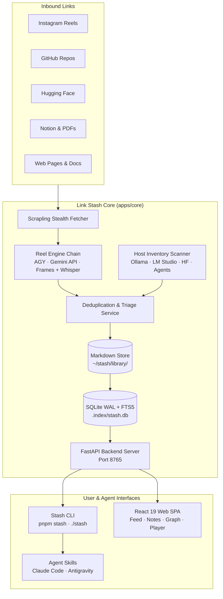

# Link Stash

<div align="center">

[](LICENSE)
[](https://www.python.org/)
[](https://nodejs.org/)
[](https://react.dev/)
[](https://tailwindcss.com/)
[](file:///docs/progress-tracker.md)

**Turn tech reels, GitHub repos, Hugging Face models, and docs into a local, searchable markdown knowledge library on your machine.**

[Quickstart](#quickstart) • [Architecture](#architecture) • [CLI Reference](#cli-command-reference) • [Agent Skills](#portable-agent-skills) • [Configuration](#configuration) • [Contributing](CONTRIBUTING.md)

</div>

---

## Overview

When you save links from Instagram reels, Twitter posts, or developer threads, they usually get lost in bookmarks without context. **Link Stash** rescues them:

1. **Universally extracts** media, metadata, rendered DOMs, and outbound links from Instagram reels, GitHub repos, Hugging Face models, Notion pages, PDFs, and arbitrary web pages without requiring fragile third-party APIs.
2. **Analyzes reels** by transcribing speech, running OCR on on-screen text, detecting mentioned tools, and extracting call-to-action keywords.
3. **Checks your local inventory** (Ollama models, LM Studio cache, Hugging Face models, agent configs, and dev tools) to flag items you already have before creating duplicates.
4. **Saves human-readable markdown cards** with strict YAML frontmatter to your local filesystem (`~/stash/library/`).
5. **Maintains a disposable SQLite FTS5 search index** for lightning-fast full-text search, bidirectional wikilinks (`[[slug]]`), and interactive WebGL graph visualization.
6. **Integrates with AI coding agents** (Claude Code, Antigravity) through portable skills that suggest relevant tools and practices before you write code or install packages.

---

## Architecture



### Data Layout (`STASH_HOME`, defaults to `~/stash`)

All your data lives on disk in plain, readable files:

```
~/stash/
├── config.toml         # Optional user overrides (port, paths, category colors)
├── .env                # Optional API keys (GEMINI_API_KEY, GITHUB_TOKEN)
├── inventory/          # Scanned environment tools and manual additions
│   ├── auto/           # Auto-scanned models, skills, tools (24h freshness)
│   └── manual/         # Manually added practices and tools
├── library/
│   ├── items/          # Categorized markdown cards (models, tools, ui-ux, etc.)
│   ├── sources/        # Saved reel videos, audio transcripts, thumbnails, raw JSON
│   ├── pending.md      # Items waiting on DM links or manual URLs
│   └── rejected.md     # Discarded suggestions log
└── .index/stash.db     # Disposable SQLite index (WAL mode + FTS5 full-text search)
```

---

## Quickstart

### Prerequisites

- **Python 3.14+** managed via [uv](https://docs.astral.sh/uv/) (uv installs Python automatically if needed).
- **Node.js 20+** and [pnpm](https://pnpm.io/).
- **ffmpeg** on your system PATH (required for audio extraction and video analysis).

### 1. One-Step Setup

Clone the repository and install all dependencies:

```bash
git clone https://github.com/your-username/stash.git
cd stash

# Installs Node deps, Python virtualenv, global `stash` command (uv tool), links agent skills, prints changelog
pnpm setup
```

### 2. Verify Your Environment

Run the doctor command to check required tools on your PATH:

```bash
pnpm stash doctor
```

*(You can also run `./stash doctor` on Linux/macOS or `.\stash.ps1 doctor` on Windows).*

### 3. Start Development Servers

Run both the FastAPI backend and Vite frontend concurrently:

```bash
pnpm dev
```

- **Web App**: Open [http://localhost:5173](http://localhost:5173) in your browser.
- **Backend API**: Running at [http://127.0.0.1:8765](http://127.0.0.1:8765) (docs at `/docs`).

### 4. Production Mode

Build the static frontend and serve everything from the single FastAPI server:

```bash
pnpm build
pnpm stash serve
```

The app is now accessible directly at [http://127.0.0.1:8765](http://127.0.0.1:8765).

---

## CLI Command Reference

You can invoke the CLI using `pnpm stash <command>`, `./stash <command>` (bash), `.\stash.ps1 <command>` (PowerShell), or the global `stash` command (installed by `pnpm setup`; refresh alone with `pnpm tool:install`).

| Command | Purpose | Example |
| --- | --- | --- |
| `stash doctor` | Check environment, paths, and tools on PATH. | `pnpm stash doctor` |
| `stash suggest` | Query installed tools, saved library cards, and practices for a task. | `pnpm stash suggest "how to build a web scraper" --text` |
| `stash extract` | Extract links into local source records. | `pnpm stash extract https://instagram.com/reel/...` |
| `stash analyze` | Analyze a downloaded reel video using AI vision/audio engines. | `pnpm stash analyze ig:XYZ123` |
| `stash ingest` | Ingest structured reel JSON into sources from a file or stdin. | `pnpm stash ingest ig:XYZ123 analysis.json` |
| `stash scan` | Rescan local environment (Ollama, LM Studio, agent skills, tools). | `pnpm stash scan` |
| `stash have` | Register installed tools, UI references, or practices into inventory. | `pnpm stash have "Docker" --kind tool --origin manual` |
| `stash check` | Deduplicate and score candidate cards against library and inventory. | `pnpm stash check candidate.json` |
| `stash save` | Atomically save and index a structured markdown card. | `pnpm stash save card.json --category repos-tools` |
| `stash pending` | List, add, or resolve comment-for-link and DM-gated items. | `pnpm stash pending list` |
| `stash reject` | Discard a candidate and log it in `rejected.md`. | `pnpm stash reject candidate.json` |
| `stash reindex` | Rebuild SQLite index from markdown cards and inventory. | `pnpm stash reindex` |
| `stash serve` | Run the library server (serves API and built static frontend). | `pnpm stash serve --port 8765` |
| `stash openapi` | Export OpenAPI JSON schema for TypeScript client generation. | `pnpm stash openapi > apps/web/openapi.json` |
| `stash install-skills` | Link portable agent skills into Claude Code and Antigravity. | `pnpm stash install-skills --workspace` |

---

## Portable Agent Skills

Link Stash includes portable agent skills compatible with **Claude Code** and **Antigravity**. These skills allow coding agents to check your personal stash before reinventing the wheel or installing redundant dependencies:

| Slash Command | Agent Behavior |
| --- | --- |
| `/stash-suggest <task>` | Consults your stash for installed tools, saved library cards, and team practices before starting a new feature or installing packages. |
| `/stash [links]` | Extracts reels, repos, or documentation, runs OCR and audio transcription, checks local inventory, and generates structured cards. |
| `/stash-init` | Guided or bulk onboarding questionnaire to populate your personal inventory with existing tools, frameworks, and coding practices. |
| `/stash-have <name>` | Quickly adds a tool, custom model, or UI reference into your manual inventory without leaving the chat. |
| `/stash-pending` | Views and resolves pending items awaiting links from creator DMs or comments. |
| `/stash-scan` | Forces an immediate rescan of your machine's installed tools and LLM models. |

Install skills to your agent environments at any time:
```bash
pnpm skills:install
```

---

## Configuration

### `config.toml` (Optional)

Located at `~/stash/config.toml` (or `$STASH_HOME/config.toml`):

```toml
# Port for `stash serve` (default: 8765)
port = 8765

# Built web app distribution path (defaults to apps/web/dist)
# web_dist = "path/to/apps/web/dist"

# Custom category colors (seed categories have built-in color tokens)
[category_colors]
my-category = "cat-extra-1"
```

### `.env` (Optional)

Located at `~/stash/.env`:

```bash
# Optional: Google Gemini API key for reel understanding
GEMINI_API_KEY=your_gemini_api_key

# Optional: GitHub personal access token (falls back to `gh auth token`)
GITHUB_TOKEN=your_github_token
```

---

## Quality & Testing

Link Stash maintains a strict, verified quality bar:

```bash
# Run backend (pytest) and frontend (vitest) test suites
pnpm test

# Run linters (Ruff + ESLint)
pnpm lint

# Strict typechecking (Pyright strict + tsc -b)
pnpm typecheck

# Verify frontend bundle size (initial gzip <= 250 KB budget)
pnpm check:bundle
```

---

## Contributing

Contributions are welcome! Please check out [CONTRIBUTING.md](CONTRIBUTING.md) for instructions on project setup, coding conventions, and pull request guidelines.

---

## License

This project is licensed under the terms of the [MIT License](LICENSE).
