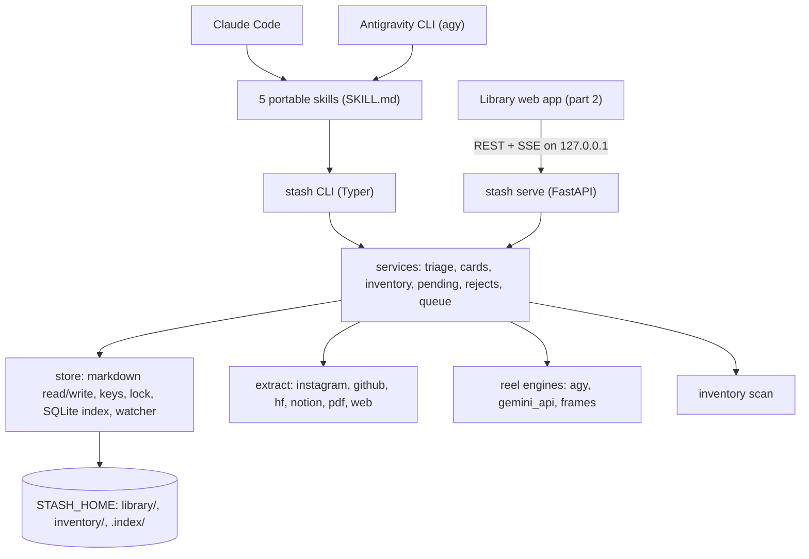

# Link Stash: Core Spec

Oct 5, 2026 · Hriday Singh Dube

Part 1 of 2. This file covers the pipeline: CLI, skills, extractors, reel engines, inventory, store and dedup. Part 2, the local web app for browsing and editing the library, is in [library-app-spec.md](library-app-spec.md). Progress tracking across all milestones is in [progress-tracker.md](progress-tracker.md).

## Overview

Link Stash turns links pasted into Claude Code or Antigravity CLI into a deduplicated, categorized markdown library of things worth having, checked against what is already installed. "Link Stash" is a working name.

**Problem.** Useful reels, GitHub repos and Hugging Face models get scrolled past and lost. Nothing records whether an item is new, a duplicate of something already installed, or needs a "comment X" step to unlock.

**Goal.** Paste one or many links, or import the whole Instagram saved backlog. The system extracts what each one points to, compares it against the inventory, asks only when needed, and saves a confirmed card per item. A local web app (part 2) browses and edits the result.

**Audience.** Built for one person on one Windows machine (the Predator) first. Every path, agent and engine lives in `config.toml`, never in code, so someone else can clone the repo, edit the config and run it. Windows is the primary target; macOS and Linux are kept working in CI but not tuned.

**Inputs (v1).** Instagram reels and posts, GitHub repos, Hugging Face repos, and Instagram's own data export (`saved_posts.json`). Notion pages, PDFs and generic links are accepted through the same pipe.

**Non-goals (v1).**

- No installing, cloning or pulling anything. The library is list only.
- No mobile capture, Telegram bot or always-on cloud server.
- No auto-commenting on Instagram.
- No triage in the web app. Judgment needs an agent; the app only shows and edits results.
- No hardware-fit or popularity scoring as a filter. Facts like stars or size are recorded, not judged.
- No embeddings. Revisit past about 1,000 cards.

## Locked decisions

Every row below was decided in the scoping sessions on Oct 5, 2026. Change a row here before changing code.

| Area | Decision | Why |
| --- | --- | --- |
| Audience | Personal first, cloneable: all machine specifics in `config.toml` | Public repo that actually runs for others later |
| Capture | Paste links into Claude Code or Antigravity CLI (agy), one or many at a time; bulk import from Instagram's data export | No mobile/server infra; the saved backlog is the real pile |
| Host | acer-predator (Windows); CI also runs Ubuntu | Agent configs, Scrapling and Claude Code live there |
| Repo vs data | Code in this repo; data in `STASH_HOME` (default `~/stash`), never committed | Clean public repo; library can be backed up or versioned on its own |
| Runtime | Python 3.14 via `uv`; `uv tool install` puts `stash` on PATH | Lockfile, fast, standard for new Python repos |
| Commands | `/stash`, `/stash-init`, `/stash-have`, `/stash-pending`, `/stash-scan` | Written once as Agent Skills (SKILL.md); both CLIs expose each skill as a slash command |
| Universal fetch | Scrapling is used everywhere across all link types (Instagram, GitHub, Hugging Face, Notion, PDF downloads, and generic web links) with `Fetcher` and `StealthyFetcher` | Bypasses anti-bot challenges, handles JS rendering, and provides zero-config scraping without requiring API tokens |
| Instagram fetch | Embed page via Scrapling `StealthyFetcher`, no login; burner cookies only as fallback | Tested Oct 5: 18/18 embed pages, video links play logged out |
| Reel understanding | In Antigravity, agy reads the mp4 itself; in Claude Code, stash calls agy headless; then Gemini API key, then contact sheet + whisper | Oct 5 test: agy read 3/3 mp4s natively; Claude has no video input |
| GitHub fetch | Scrapling page scraping + raw files as universal fetcher; REST API backend as companion when a token exists (`gh auth token`, else `GITHUB_TOKEN`) | Scrapling runs everywhere with zero setup; API offers higher rate limits if a token is present |
| Hugging Face fetch | Scrapling on model/dataset/space pages (with `huggingface_hub` metadata integration) | Extracts architecture, parameter sizes, GGUFs, tags, and downloads even for gated or custom landing pages |
| Notion & Web fetch | Scrapling `StealthyFetcher` for Notion and JS-rendered pages; `Fetcher` escalating to `StealthyFetcher` on 403/JS for all generic links | Extracts title, readable content, and all outbound links across any website reliably |
| Library format | Markdown folder, one card per thing; markdown is the source of truth | Greppable by either CLI, portable, editable by hand |
| Index | SQLite + FTS5 at `STASH_HOME/.index/stash.db`, derived from markdown, rebuilt any time | Fast dedup, search, backlinks and graph; deleting it loses nothing |
| Raw content | Separate `sources/<id>/` per link; cards link to it | Cards stay short |
| Video retention | Keep `video.mp4` and `thumb.jpg` for every reel | In-app player works offline and after the reel is deleted |
| Card language | English; transcript kept in original language | Hindi/Hinglish reels |
| Multi-item reels | One card per repo/model/skill, all pointing to the same source | Dedup works per thing |
| Practice reels | Saved as Practice cards (1-3 line takeaway) | Advice is still worth keeping |
| Categories | Seed set, new ones proposed and confirmed | Grows with use |
| Value test | Fills a gap vs inventory + library | Only criterion |
| Action | List only, never installs | Safety and simplicity |
| Review | Batch paste, review as a summary table, drill into any row | Fast for 10+ links |
| Ask when | Blocked, overlap found, unclear intent, and always before save | Nothing saved silently |
| Comment-for-link | Pending queue, listed at session start | Closes the ManyChat loop |
| Rejects | Logged with reason, flagged if seen again | No repeat triage |
| Inventory | Agent configs + Ollama + LM Studio + Hugging Face cache scan, plus manual md files | Manual files grow via `/stash-init`, `/stash-have` |
| Rescan | Auto when snapshot is older than 24 h; `/stash-scan` forces it | Fresh without slowing every run |
| Single writer | Every write (CLI, skills, web app) goes through the core services and one lock | Both CLIs and the app produce identical files |
| Library app | Own local web app served by `stash serve` (part 2) | Library-first thumbnail grid with backlinks, graph and stash-specific views |

## Architecture

The system is one Python package used three ways, plus portable skills and a web frontend. The `stash` package does every fetch, scan, index and file write. The skills only tell whichever agent is running when to call it, how to judge overlap, and what to ask you. The web app talks to the same package over a local HTTP API.



Links go down through the skills into the CLI. The services fan out to the extractors (and the reel engines for reels), check the inventory and index, and write cards through the store once you approve them. `stash serve` watches `library/` and `inventory/`, reindexes changed files, and pushes changes to the web app.

### Repo layout (this folder)

```
stash/
  apps/
    core/                     uv project, Python package `stash`
      pyproject.toml  uv.lock
      src/stash/
        cli/                  Typer commands, thin: parse args, call services, print JSON
        server/               FastAPI routes, thin: validate, call services, return JSON
        services/             business logic shared by cli/ and server/
        extract/              instagram.py github.py hf.py notion.py pdf.py web.py ig_export.py
        reel/                 engines (agy.py gemini_api.py frames.py), prompt.md, schemas/reel.json
        inventory/            one scanner per tool
        store/                cards.py keys.py lock.py index.py watcher.py models.py
        config.py             loads STASH_HOME/config.toml and .env
      tests/                  unit, fixtures/ (recorded HTML/JSON), live/ (marked, run by hand)
    web/                      part 2
  skills/                     stash/ stash-init/ stash-have/ stash-pending/ stash-scan/
  docs/
  config.example.toml  .env.example
  .github/workflows/ci.yml
```

`cli/` and `server/` hold no business logic. Pydantic models in `store/models.py` define cards, sources, records and API payloads. FastAPI publishes them as OpenAPI, and the web app generates its TypeScript types from that spec, so there is one contract.

### Data layout (`STASH_HOME`, default `~/stash`)

```
~/stash/
  config.toml           paths, reel_engines order, batch sizes, port, category colors
  .env                  GEMINI_API_KEY, optional GITHUB_TOKEN
  inventory/
    auto/<tool>.md      generated by the scan
    manual/*.md         written by you, /stash-init, /stash-have
  library/
    items/<category>/<slug>.md
    sources/<source-id>/
      source.md         caption, engine summary, transcript, links, stage
      raw.json          full extractor + engine output
      video.mp4         downloaded reel, kept
      thumb.jpg         poster image or first frame
      contact.jpg       only when the frames fallback ran
    pending.md          comment-for-link and blocked items
    rejected.md         key, date, reason
    queue.md            imported links waiting for triage
  .index/stash.db       derived SQLite index, safe to delete
  cache/                per-run JSON, partial downloads
  logs/                 stash.log (JSON lines), failed.jsonl, scan.log
  .lock
```

## Source extractors

Every link goes through `stash extract <url>`, which returns one JSON record per source with the same shape. **Scrapling is the universal web extraction engine across every link type.** Rather than relying on fragile raw HTTP requests or requiring API tokens for third-party platforms, Link Stash uses Scrapling everywhere. Fast static retrieval uses Scrapling's `Fetcher`, while JavaScript-rendered, Cloudflare-protected, or bot-challenged targets automatically leverage Scrapling's `StealthyFetcher` (with browser TLS and header fingerprint spoofing). No LLM picks how to fetch. Every network call has a timeout and retries with backoff.

| Source | URL patterns | Primary method | Fallbacks | Key fields captured |
| --- | --- | --- | --- | --- |
| Instagram reel/post | `instagram.com/[user/]reel\|reels\|p\|tv/<code>` | Scrapling `StealthyFetcher` on `/<type>/<code>/embed/captioned/`, resources disabled, batches of at most 6 | 1. yt-dlp with burner `cookies.txt` 2. ask for an mp4 path | shortcode, author, caption, comment count, video URL, poster image, carousel items, `oe` expiry |
| GitHub repo | `github.com/<owner>/<repo>[/...]` | Scrapling on `github.com/<o>/<r>` + raw files (universal); REST API (`GET /repos/{o}/{r}`, `/readme`, `/git/trees/HEAD`) if `GITHUB_TOKEN` is found | Dual backends fallback to each other | canonical `owner/repo`, description, stars, last push, archived, license, topics, language, has `SKILL.md` / plugin.json / MCP server |
| Hugging Face | `huggingface.co/<org>/<name>`, `/datasets/...`, `/spaces/...` | Scrapling on the page + `huggingface_hub` `model_info(files_metadata=True)` | Scrapling page parse fallback if Hub API is unavailable | repo id, type, pipeline tag, params (safetensors), GGUF files, gated, license, downloads, last modified |
| Notion page | `*.notion.site/...`, public `notion.so/...` | Scrapling `StealthyFetcher`, network idle, markdown | Notion `loadPageChunk` endpoint; private page → ask | title, text, every outbound link |
| PDF (remote or local) | URL ending `.pdf` or a local path | Scrapling `Fetcher` downloads remote PDF to cache; PyMuPDF text + `page.get_links()` | OCR only if no text layer | text, every link inside |
| Generic link | anything else (blogs, docs, landing pages, tools) | Scrapling `Fetcher`, auto-escalating to `StealthyFetcher` on 403 / Cloudflare / JS pages | ask for a pasted copy | title, main text, outbound links, mentioned GitHub/HF assets |
| Instagram data export (optional) | local `saved_posts.json` | `stash import-ig-export <file>`: parse, normalize to `ig:` keys, drop already-processed, append to `queue.md` | none | URL, saved date |

**Universal Scrapling web extraction across all sources:**

- **GitHub repos:** Scrapling parses `github.com/<o>/<r>` to extract stars (exact count in the counter's `title`), description, topics, license, archived banner, last commit, root file list, and canonical name via 301 redirects on renamed repos. Raw file probes (`SKILL.md`, `.claude-plugin/plugin.json`, `package.json`, `pyproject.toml`) and folder listings are fetched via Scrapling. The REST API is available as a companion backend when `GITHUB_TOKEN` or `gh auth token` exists.
- **Hugging Face models & spaces:** Scrapling fetches `huggingface.co/<org>/<name>` directly. It extracts pipeline tags, license, downloads, model card README markdown, file trees, and detects GGUF quantizations from the file tree DOM, working seamlessly alongside or without the `huggingface_hub` API.
- **Notion pages:** Public Notion docs (`*.notion.site` or `notion.so`) are rendered using Scrapling's `StealthyFetcher` until network idle, extracting page titles, body text blocks, and all outbound reference URLs.
- **Generic links & articles:** Any URL that does not match a specialized extractor is fetched using Scrapling's `Fetcher`. If a 403, 401, Cloudflare challenge, or empty JavaScript shell is detected, it automatically escalates to `StealthyFetcher` to render the DOM, strip boilerplate scripts/styles, extract title and meta descriptions, and discover all outbound links and mentioned tools.
- **PDF downloads:** Remote PDF URLs are retrieved using Scrapling's fetcher into the local cache before passing to PyMuPDF for high-fidelity text and hyperlink extraction.
- **Recorded fixtures & tests:** Both static and stealth scrape backends are backed by recorded fixtures, and `pytest -m live` validates layout changes against live sites.

**Instagram notes from the Oct 5 test**

- The embed page loaded for 18/18 public items with no login. Caption, author and a direct video link came back every time.
- The video URL carries `oe=<hex epoch>`. The one tested expired about 33 h after fetch, so the app downloads it in the same run and stores the expiry.
- The video file has audio and video in one progressive mp4, so one download feeds the reel engines.
- The app uses Scrapling as a Python library, not the MCP server. That keeps it runnable from either CLI.
- Instagram was unreachable from the cloud sandbox used for testing. Fetching runs on the Predator's home connection.
- The embed page blocks right-click saving; download the `<video src>` URL directly (httpx).
- `thumb.jpg` comes from the embed page's poster image, else the first ffmpeg frame.

**Follow-through (one level).** Every record lists the links and names it mentions. GitHub and HF links are extracted immediately. A bare name such as "a repo called X" is resolved with GitHub search and marked low confidence, which triggers the "unclear" question.

**Comment-for-link detection.** A caption or transcript matching *comment / type / drop / reply + a quoted or ALL-CAPS word* sets `cta.keyword`. That is a hint, not a route: most CTA posts (7 of 12 in the Oct 6 test) also name the repos or tools in the caption, video, on-screen text or carousel slides. Commenting is the last resort. The item goes to the pending queue ("Comment `<KEYWORD>` on <reel>") only when `cta.keyword` is set **and** analysis finds no concrete mention (no URL, no resolvable name).

**Resumable stages.** Each source records its stage in `source.md` frontmatter: `fetched` → `analyzed` → `triaged` → `saved | rejected | pending`. A batch that dies part-way resumes from the last stage per source. Download and engine runs never repeat for a shortcode that already has them. Failures are appended to `logs/failed.jsonl` and retried with `stash extract --retry-failed`.

## Reel understanding

Who reads the video depends on the CLI you are in. In Antigravity, the agent opens the mp4 itself. In Claude Code, `stash` calls `agy` with no window and reads its JSON. A Gemini API key, then a contact sheet plus a whisper transcript, are the fallbacks. Results are cached by shortcode and never re-run.

**Engine by host**

| You are in | Who reads the video | How |
| --- | --- | --- |
| Antigravity CLI | the running agy agent | The skill tells it to open `sources/<id>/video.mp4` with its file viewer, read the caption next to it, fill the schema, and pipe the JSON to `stash ingest <id> -` |
| Claude Code | agy, called by `stash` | `stash analyze <id> --engine agy` runs `agy -p "<prompt>" --output-format json --json-schema schemas/reel.json --print-timeout 5m` inside `sources/<id>/` and reads `.structured_output` |
| Either, agy fails | Gemini API | google-genai, `gemini-3.8-flash`, inline under 20 MB, `media_resolution` high, same prompt and schema |
| Either, all above fail | the host agent | ffmpeg scene frames (at most 12) tiled into one labeled `contact.jpg` (timestamp on each tile) + faster-whisper `small` transcript; the agent reads the one image and fills the schema |

The skill picks the row by asking one question: "Can you open video files yourself?" Antigravity says yes and takes row 1. Claude Code says no and runs `stash analyze`, which walks rows 2 to 4 in the order set in `config.toml` (`reel_engines = ["agy", "gemini_api", "frames"]`). Every result records which engine produced it.

Whisper runs in the frames path only when the caption and on-screen text do not already carry the speech.

**Input to every engine.** The video, the caption, the author handle and carousel images, always together. In the Oct 5 test, reel 3's real facts (speed, Haiku 5.5, URL) were only in the caption.

**Output schema** (`apps/core/src/stash/reel/schemas/reel.json`)

```json
{
  "summary": "one paragraph, English",
  "spoken_language": "en|hi|... or null",
  "transcript": "original language, or null",
  "transcript_source": "audio|burned_subtitles|none",
  "on_screen_text": ["only text that carries information"],
  "mentions": [
    {"kind": "repo|model|skill|plugin|mcp|tool|ui_ref|link",
     "name": "...",
     "url": "... or null",
     "url_source": "on_screen|spoken|caption|inferred",
     "evidence": "spoken|on_screen|caption",
     "at": "MM:SS or null"}
  ],
  "features": {"<mention name>": ["feature or setting shown"]},
  "takeaways": ["practices, stats, comparisons; 1-3 lines each"],
  "cta": {"type": "comment|link_in_bio|url|none", "keyword": "or null", "what_you_get": "..."},
  "engine": "agy-host|agy-headless|gemini-api|frames",
  "confidence": "high|medium|low"
}
```

**Mention rules (in every engine's prompt)**

- A mention is something you could install, use, download or bookmark on its own.
- Features and settings of a mentioned tool go under `features`. Example: Dependabot and branch protection under gh-secure, not as their own mentions.
- Benchmarks, numbers and comparisons go in `takeaways`, never in `mentions`.
- A URL the model built itself (e.g. a GitHub URL from an install command) gets `url_source: inferred`. `stash` checks it against the GitHub/HF API before saving.
- Decorative on-screen text (dial numbers, logos) is left out.
- When unsure, use null. Never guess.

**Oct 5 test: agy, video only, no caption**

| Reel | What agy got | What it got wrong |
| --- | --- | --- |
| gh-secure (37 s) | Tool, GitHub Security Lab, every terminal command on screen, `gh.io/gh-secure` | Split 5 features into separate mentions; inferred the repo URL |
| HydraFusion (68 s) | Name, Opus 5, Terminal-Bench 2.1, 67% lower cost, full transcript, `gh.io/HydraFusion` | Labelled the benchmark a "practice" |
| Sonnet 5.5 (13 s) | Model name; correctly reported no narration | Padded the summary with visual description |

agy opened all 3 mp4s natively. Audio is unproven: the only transcript matched subtitles burned into the video word for word, and the other two reels returned none. The mention rules and `transcript_source` above come from this test.

**Not used.** Passing the mp4 straight to Claude, which has no video input.

## Inventory

The inventory is everything you already have. It comes from two places: an automatic read-only scan, and markdown files you write. Both are indexed into the `inventory` table in SQLite, which dedup and overlap checks read.

**Automatic scan (`stash scan`, auto when older than 24 h)**

| Tool | What is read | Paths on the Predator (defaults, overridable in `config.toml`) |
| --- | --- | --- |
| Claude Code | skills, plugins, subagents, MCP servers, CLAUDE.md | `~/.claude/skills/*/SKILL.md`, `~/.claude/plugins/`, `~/.claude/agents/`, `~/.claude.json` (`mcpServers`) |
| Shared Agent Skills | skills | `~/.agents/skills/`, legacy `~/.agent/skills/` |
| Antigravity CLI / IDE | skills, plugins, MCP servers, rules | `~/.gemini/antigravity-cli/skills/`, `~/.gemini/antigravity-cli/plugins/`, `~/.gemini/config/skills/`, `~/.gemini/config/mcp_config.json`, `~/.gemini/GEMINI.md` |
| Codex | skills, MCP servers | `~/.codex/skills/`, `~/.codex/config.toml` |
| Qwen, Trae | MCP servers, settings | `~/.qwen/settings.json`, `~/.trae/` |
| Other agent tools | presence only (tool is installed) | `~/.claude-mem`, `~/.mem0`, `~/.impeccable`, `~/.caveman`, `~/.omniroute` |
| Ollama | pulled models | `ollama list`, else `~/.ollama/models/manifests/` |
| LM Studio | downloaded models | `lms ls`, else `~/.lmstudio/models/<publisher>/<repo>/` |
| Hugging Face cache | downloaded model/dataset repos | `~/.cache/huggingface/hub/models--<org>--<name>/`, `datasets--...` |

On the Predator `~` is `C:\Users\clash`; `~/.claude` is confirmed there. The scan writes `inventory/auto/<tool>.md`, one line per thing, with a `scanned_at` timestamp in the frontmatter. It never edits the tools' own files. A missing path is skipped and logged.

**Manual files (`inventory/manual/*.md`)**

These are your own lists: UI component references, tools you use, practices you follow, anything the scan cannot see. One line per entry:

```markdown
- [ui_ref] shadcn/ui — default component kit (key: github:shadcn-ui/ui)
- [tool] Scrapling — stealth scraping, MCP on Predator (key: github:d4vinci/scrapling)
- [practice] Plan mode before multi-file edits
```

- `/stash-init` walks you through a brain dump, one category at a time, and writes these files.
- `/stash-have <thing or url>` appends one line, resolving the key if it is a URL. Use it right after installing something. The web app's Inventory view calls the same service.
- Hand edits are fine. The watcher (or the next run) reindexes them.

## Library

The library is plain markdown under `STASH_HOME/library`. There is one card per thing, raw material sits in `sources/`, and three files track state: `pending.md`, `rejected.md` and `queue.md`.

**Seed categories** (folder name, then what goes in it)

| Folder | Holds |
| --- | --- |
| `models` | AI models: HF repos, Ollama/LM Studio tags |
| `skills-plugins` | Agent skills, Claude/Antigravity plugins, skill packs |
| `mcp-servers` | MCP servers |
| `repos-tools` | Other GitHub repos, CLIs, apps |
| `ui-ux` | Component libraries, design references, UI kits |
| `practices` | Prompts, workflows, techniques with no artifact |

A new category is proposed in the review table and created only after you confirm it.

**Card format** (`items/<category>/<slug>.md`)

```markdown
---
schema: 1
key: github:owner/repo          # dedup identity, see Dedup
title: Repo Name
category: repos-tools
kind: repo                      # repo|model|skill|plugin|mcp|tool|ui_ref|practice|link
tags: [agents, scraping]
added: 2026-10-05
url: https://github.com/owner/repo
sources: [ig:DdpKWz1ymmi]       # every source that mentioned it
facts:                          # repos
  stars: 12400
  pushed_at: 2026-09-30
  license: MIT
  archived: false
# facts for models: params, gguf, gated, license, downloads
features: []                    # from the engine's features map
overlaps: [github:other/repo]   # inventory/library keys judged similar
---

**What it is.** One line.

**Why it fills a gap.** One or two lines against what you already have.

**Notes.** Optional, your words. May link other cards as [[slug]].

**Origin.** @creator, [reel](https://instagram.com/reel/DdpKWz1ymmi), at 00:23 (on screen) → [source](../../sources/ig-DdpKWz1ymmi/source.md)
```

- `schema` versions the card format. A future format change ships a `stash migrate-cards` command that prints a dry-run diff first; you run it, it never runs on its own.
- Structured relations (`sources`, `overlaps`) are keys in frontmatter, so they survive a card moving category. Freeform links in the body use `[[slug]]`. Slugs are unique across the library; a clash gets a numeric suffix.
- The creator handle lives on the source (`creator: "@handle"` in `source.md`), not on the card. The index and app derive creator nodes from it.
- Practice cards use the same frontmatter with `key: practice:<slug>`, and their body is the 1-3 line takeaway.

## Store and index

`store/` is the only code that touches files in `STASH_HOME`.

- **Writes.** Every write takes `STASH_HOME/.lock` (a second writer waits up to 30 s, then aborts with a message), writes to a temp file and renames it into place, then updates the index for that file in the same call.
- **Card round-trip.** Reading and writing an unchanged card produces identical bytes. Frontmatter key order is fixed.
- **Content hash.** Each card's hash is stored in the index. Writes from the web app carry the hash they were based on; a mismatch returns 409 instead of overwriting.
- **SQLite index** (`.index/stash.db`, WAL mode), built only from markdown:

| Table | Holds |
| --- | --- |
| `cards` | key, path, slug, title, category, kind, added, url, hash, mtime, frontmatter JSON |
| `sources` | id, platform, creator, url, stage, video/thumb paths, engine, fetched_at, cta |
| `links` | from_key, to_key, type (`source`, `overlap`, `wikilink`); drives backlinks and the graph |
| `tags` | key, tag |
| `inventory` | key, name, kind, origin (tool or manual file) |
| `rejects`, `pending`, `queue` | parsed from their markdown files |
| `search` | FTS5 over title, body, transcript, caption |

- **Schema version.** The DB stores its schema version. On a mismatch it is deleted and rebuilt from markdown. It is a derived cache, not a migration of your data.
- **Watcher.** `watchfiles` (inside `stash serve`) reindexes only the changed file, including hand edits in VS Code. `stash reindex` rebuilds everything.

## Commands and the triage skill

Five skills drive the `stash` CLI. Each skill is a portable `SKILL.md` that works the same in Claude Code and Antigravity CLI, because the CLI does all reading and writing and the agent only judges and asks.

**Skills (slash commands in both CLIs)**

| Skill | What it does | CLI calls |
| --- | --- | --- |
| `/stash [links]` | Full triage: extract, analyze, check, review table, save. With no links, takes the next chunk from `queue.md` | `scan --if-stale`, `queue next`, `extract`, `analyze` or `ingest`, `check`, `save`, `reject`, `pending add` |
| `/stash-init` | Guided brain dump into `inventory/manual/` | `have` (repeated) |
| `/stash-have <thing>` | Add one installed thing to the inventory | `have` |
| `/stash-pending` | List pendings; paste a DM'd link to resolve one | `pending list`, `pending resolve` |
| `/stash-scan` | Force an inventory rescan | `scan` |

**CLI subcommands** (all print JSON with `--json`; exit 0 ok, 1 error, 2 usage)

- `stash extract <url...> [--retry-failed]`
- `stash analyze <id> [--engine agy|gemini_api|frames]`
- `stash ingest <id> -` (reads engine JSON from stdin; used when agy reads the video in-session)
- `stash scan [--if-stale]`
- `stash check <record.json>`
- `stash save <card.json>`
- `stash reject <key> --reason`
- `stash pending list|add|resolve`
- `stash have <text|url>`
- `stash import-ig-export <saved_posts.json>`
- `stash queue list|next [--n 15]`
- `stash reindex`
- `stash serve [--port] [--dev]` (`--dev`: API only, for the Vite dev server)
- `stash install-skills`

**`/stash` flow**

1. List open pendings, if any, in one line each. If `queue.md` has items, say how many.
2. Run `stash scan --if-stale`.
3. Run `stash extract` on the pasted links, or on `stash queue next` when none were pasted. Media is downloaded, then each reel is read by the engine for this CLI (see Reel understanding).
4. Split each record into things: one candidate per mention, plus a practice candidate when there are takeaways.
5. Run `stash check` per candidate. It returns exact key hits in the library, inventory and rejects, plus same-kind names for the overlap judgment.
6. The agent judges overlap, picks a category and drafts each card.
7. Show the review table (below) with the questions underneath: overlaps, unclear items, blocked items.
8. You answer in one message, e.g. `save 1 2 4, skip 3 (have firecrawl), 5 -> ui-ux, show 6`.
9. Run `stash save`, `stash reject` or `stash pending add` per row, then print one summary line.

**Review table shape**

```markdown
| # | Thing              | Kind     | Category    | Verdict                              | Proposed |
|---|--------------------|----------|-------------|--------------------------------------|----------|
| 1 | owner/agent-kit    | repo     | repos-tools | new                                  | save     |
| 2 | Qwen3-8B-GGUF      | model    | models      | overlap: qwen3:8b in Ollama          | ask      |
| 3 | firecrawl          | tool     | repos-tools | rejected 2026-09-12 (have Scrapling) | skip     |
| 4 | "Plan before edits"| practice | practices   | similar to manual entry              | ask      |
| 5 | reel DdXy...       | -        | -           | blocked: comment GUIDE               | pending  |
```

**Making one skill set work in both CLIs**

- **One copy.** Skills live in this repo's `skills/`. `stash install-skills` links each folder (a Windows junction, `mklink /J`; a symlink elsewhere) into `~/.claude/skills/` and `~/.gemini/antigravity-cli/skills/`, plus `~/.gemini/config/skills/` for the Antigravity IDE. Target paths come from `config.toml`. An edit shows up in all three.
- **Portable frontmatter.** Only `name` and `description`, the two fields both tools read.
- **No tool-specific calls.** The skill text says "ask the user in chat" and "run `stash ...`", never Claude-only tools like AskUserQuestion or TaskCreate.
- **The CLI writes, the agent judges.** Cards, pendings and rejects are written only by `stash save/reject/pending`, so both agents produce identical files.
- **Permissions.** Pre-allow `stash`: Claude Code `Bash(stash:*)` in settings, and Antigravity `command(regex:stash .*)` in `~/.gemini/antigravity-cli/settings.json`. Headless `agy -p` called from Claude Code also needs file-read permission for `sources/` (see Open questions).

## Dedup and overlap

Duplicates are caught in two passes. An exact key match is certain and needs no LLM. An overlap ("does the same job as something you have") is judged by the agent from a short candidate list the CLI provides.

**Identity keys**

| Thing | Key | Normalization |
| --- | --- | --- |
| Instagram source | `ig:<shortcode>` | Drop username prefix, query (`igsh`, `utm_*`) and trailing slash; `/reels/` and `/tv/` map to the same code |
| GitHub repo | `github:<owner>/<repo>` | Lowercase; the API's canonical `full_name` after rename redirects; strip `/tree/...`, `.git` |
| Hugging Face | `hf:<model\|dataset\|space>:<org>/<name>` | Lowercase; quantized variants (`-GGUF`, `-AWQ`) also store a `base:` key from the model card's `base_model` |
| Ollama / LM Studio model | `ollama:<name>:<tag>`, `lmstudio:<publisher>/<repo>` | Matched against `hf:` keys through `base:` and name similarity |
| Skill / plugin | `skill:<name>`, plus the GitHub key of the repo that ships it | Name from SKILL.md frontmatter |
| MCP server | `mcp:<package or repo>` | npm/PyPI package name, else GitHub key |
| Generic link | `url:<host><path>` | Lowercase host, no `www.`, no query or fragment |
| Practice | `practice:<slug>` | Slug of the takeaway; overlap judged semantically |

**Pass 1: exact (CLI, deterministic, reads SQLite)**

- The key is in `cards` → **duplicate**. The new source is appended to that card's `sources`, and nothing else changes.
- The key is in `inventory` → **already have**. Shown in the table, default skip.
- The key is in `rejects` → **rejected before**, shown with date and reason, default skip.
- The source key (`ig:...`) already has a stage past `fetched` → cached record reused, no new video analysis.

**Pass 2: overlap (agent, with a candidate list)**

- `stash check` returns up to 10 same-kind entries from cards and inventory, ranked by fuzzy name match (rapidfuzz) and shared tags.
- The agent labels the candidate **same thing** (treated as a duplicate), **same job** (overlap, asks you) or **different**, with one line of reasoning.
- For an overlap, you choose: keep both, skip, or save with a note "alternative to X". The choice is stored in the card's `overlaps`.

## Failure modes

Instagram changes are the biggest risk: instaloader broke in June 2026 and has been degrading again since Sep 4. Every failure below ends in a named state, never a silent drop.

| Failure | How it shows | Handling |
| --- | --- | --- |
| Embed page blocked or changed | No `<video>` / no caption, or redirect to login | yt-dlp with burner cookies → ask for mp4 → pending `blocked:fetch` |
| Video URL expired | HTTP 403 on download, `oe` in the past | Re-fetch the embed page once |
| Instagram rate limit | 429 or empty pages across a batch | Batches of at most 6, 2–5 s jitter, stop the batch and leave the rest queued |
| Burner flagged | `feedback_required`, checkpoint page | Stop using cookies, warn once, rely on embed + manual mp4 |
| agy or Gemini error, quota, not signed in | agy non-zero exit or status not SUCCESS; API 429 | Next engine in `reel_engines`; item records which engine ran |
| Engine finds nothing | Zero mentions and zero takeaways | Next engine once, then ask "what was this about?" |
| Private/gated content | 401/403, HF `gated: true`, private Notion | Card saved with `gated: true`, or pending `blocked:private` |
| Bare name, no URL | Mention with `url: null` | GitHub/HF search, top match marked low confidence, asked in the table |
| Inferred URL | `url_source: inferred` | Verified against GitHub/HF API; dropped to name-only if it 404s |
| Comment-for-link reel | `cta.keyword` set and analysis found zero concrete mentions | Pending `cta`, instruction shown, resolved via `/stash-pending` or the web app. With mentions found, triage proceeds normally and the keyword stays on the source as a note |
| GitHub API rate limit | 403 with `x-ratelimit-remaining: 0` | Switch to the scrape backend for the rest of the batch |
| GitHub page layout changed | Scrape backend finds no star counter / description | Switch to the API backend if a token exists; else save with facts missing and log it |
| Session dies mid-batch | Sources stuck before `triaged` | Next `/stash` resumes from each source's stage |
| Two writers at once | Lock held | Second writer waits up to 30 s, then aborts with a message |
| Card edited on disk during an app edit | Hash mismatch | API returns 409; app shows "reload / keep mine" |
| Index missing or wrong version | No DB or version mismatch | Rebuilt from markdown automatically |
| Scan path missing | Folder not found | Skipped, logged in `logs/scan.log`, not an error |

## Errors and logging

- The CLI with `--json` and the API both return errors as `{"error": {"code", "message", "details"}}`. Skills branch on `code`.
- The API has one central exception handler; routes do not catch and reshape errors themselves.
- `logs/stash.log` is JSON lines with `run_id`, `source_id`, `stage`, `level`, `msg`. No error is swallowed: each one is either logged with a named state or raised.

## Testing

| Layer | How |
| --- | --- |
| Store | Pytest table tests for key normalization, byte-identical card round-trip, lock contention, hash conflict, reindex after deleting the DB, all against a temp `STASH_HOME` |
| Extractors | Recorded fixtures (real embed HTML, GitHub/HF JSON saved once) so unit tests never touch the network. `pytest -m live` runs a small real-link smoke suite by hand |
| Reel engines | subprocess and API mocked; every engine's output validated against `reel.json` |
| Services | Dedup passes, queue, pending, `import-ig-export` with a sample export |
| API | FastAPI TestClient against a temp `STASH_HOME` |
| Lint / types | ruff (lint + format), pyright strict |
| CI | GitHub Actions on every PR: lint, typecheck, tests; core on Windows and Ubuntu |
| Hooks | Husky + lint-staged at the repo root run ruff on staged Python and ESLint/Prettier on staged TypeScript |

## Build order

Build Instagram and the reel engines first, because they carry the most risk. Each milestone ends with a test you can run. Part 2 (B milestones) is in the app spec and starts after A7.

1. **A1 Scaffold.** Monorepo, `apps/core` uv project, `apps/web` placeholder, `config.example.toml`, `.env.example`, `STASH_HOME` loading, CI, Husky. Confirm ffmpeg, `agy` and `gh` on PATH. *Done when* `stash --help` runs in PowerShell and Git Bash and CI is green.
2. **A2 Instagram extractor.** URL normalization, embed fetch, mp4 + thumbnail download, carousel items, stage tracking, `failed.jsonl`. *Done when* 20 mixed links (reels, carousels, one comment-for-link reel) produce 20 records and 20 playable files, and killing the run at item 10 then re-running finishes without re-downloading.
3. **A3 Reel engines.** Shared prompt and schema, `stash analyze` with agy headless, Gemini API, `stash ingest`, cache. Run the open agy tests here (audio, headless permissions, quota). *Done when* the 3 Oct 5 reels plus one talking-head reel give the same mentions through agy in-session, agy headless from Claude Code, and the Gemini API.
4. **A4 Store and index.** Pydantic models, card read/write, keys, lock, SQLite schema, watcher, `reindex`. *Done when* cards round-trip byte-identical and deleting `stash.db` then running `stash reindex` restores every query result.
5. **A5 Other extractors.** GitHub, Hugging Face, Notion, PDF, generic, one-level follow-through. *Done when* each has 3 passing sample links.
6. **A6 Inventory.** Scan for every path in the Inventory table (including the HF cache), manual files, `have`. *Done when* the index lists your real skills and Ollama/LM Studio/HF models.
7. **A7 Check, save, queue.** Exact pass, candidate list, save/reject/pending writers, `import-ig-export`, `queue`. *Done when* re-pasting a saved link reports "duplicate" and a sample `saved_posts.json` (your real one, if you requested it) fills the queue.
8. **A8 Skills.** The five `SKILL.md` files and `install-skills`. *Done when* `/stash` runs end to end in Claude Code, then in Antigravity CLI, producing identical cards.
9. **A9 Fallbacks.** Contact sheet + whisper path and the burner-cookie path. *Done when* forcing agy and the Gemini API to fail still yields a card.
10. **A10 First real run.** Run `/stash-init` and work through a week of saved reels. Note what felt wrong and update this spec.

## Open questions

- [ ] Does agy hear audio, or only read burned-in subtitles? Test with a talking-head reel that has no on-screen captions (A3).
- [ ] Does `agy -p` headless open an mp4 without a permission prompt? Which `permissions.allow` rule does it need (A3)?
- [ ] How many reels per day fit in the AI Pro quota through agy (`/usage`)?
- [ ] Re-run the Oct 5 test with the caption included and the new mention rules, then compare (A3).
- [ ] Gemini free-tier limits for `gemini-3.8-flash`: confirm in AI Studio before relying on it as the fallback for batches of 10+.
- [ ] Send a real comment-for-link reel to test CTA detection (A2).
- [ ] Optional: request the Instagram data export (it takes hours to days) if you want the saved backlog imported at A7. Pasting links never needs it.

**Resolved Oct 5:** `.claude` lives at `C:\Users\clash\.claude`. mp4s are kept with a thumbnail. Runtime is uv. GitHub auth comes from `gh auth token`. The HF cache is scanned. Prior art checked (below): ideas taken, no code reused.

## References

**Evidence**

| Page | What it established |
| --- | --- |
| [Gemini API: video understanding](https://ai.google.dev/gemini-api/docs/generate-content/video-understanding) | Inline under 20 MB, Files API, static vs agentic mode, tokens per second, `gemini-3.8-flash` |
| [Antigravity: Agent skills](https://antigravity.google/docs/skills/) | SKILL.md format, CLI skill paths, skills become slash commands |
| [Antigravity: workflows to skills](https://antigravity.google/docs/migration/workflows-to-skills/) | Workflows retire Nov 1, 2026; global skill paths |
| [Antigravity CLI cheat sheet](https://computingforgeeks.com/antigravity-cli-cheat-sheet/) | `agy -p`, JSON output, `--json-schema`, settings.json permissions, `agy plugin import claude` |
| [Antigravity #762](https://github.com/google-antigravity/antigravity-cli/issues/762) | IDE chat cannot attach mp4 |
| [Antigravity #560](https://github.com/google-antigravity/antigravity-cli/issues/560) | Long mp4 hangs the CLI conversation |
| [yt-dlp #16311](https://github.com/yt-dlp/yt-dlp/issues/16311) | Instagram needs login for yt-dlp (Mar 2026) |
| [instaloader PR #2706](https://github.com/instaloader/instaloader/pull/2706) | June 2026 endpoint break, fix merged Jul 26 |
| [instaloader #2738](https://github.com/instaloader/instaloader/issues/2738) | Partial failures again since Sep 4, 2026 |
| [gallery-dl #9564](https://github.com/mikf/gallery-dl/issues/9564) | Public links redirect to login in gallery-dl |
| [Whisper comparison 2026](https://www.promptquorum.com/power-local-llm/local-whisper-stt-comparison-2026) | faster-whisper int8 is usable on CPU for base/small |
| [Karakeep docs](https://docs.karakeep.app/) | Prior art: AI-tagged bookmarks, yt-dlp archiving, agent skills |

**Build with**

| Tool | Used for |
| --- | --- |
| [uv](https://docs.astral.sh/uv/) | Python project, lockfile, `uv tool install` |
| [Typer](https://typer.tiangolo.com/) | CLI |
| [FastAPI](https://fastapi.tiangolo.com/) + [Pydantic](https://docs.pydantic.dev/) | Local API, models, OpenAPI |
| [watchfiles](https://github.com/samuelcolvin/watchfiles) | Reindex on file change |
| SQLite + FTS5 (stdlib `sqlite3`) | Derived index and full-text search |
| [Scrapling](https://github.com/D4Vinci/Scrapling) | Universal web fetching engine for all links (Instagram, GitHub, Hugging Face, Notion, PDF downloads, and generic web) |
| [httpx](https://www.python-httpx.org/) | API calls and media download |
| [Antigravity CLI](https://antigravity.google/docs/skills/) | Primary video reader (in-session and `agy -p`) |
| [yt-dlp](https://github.com/yt-dlp/yt-dlp) | Instagram fallback with burner cookies |
| [google-genai SDK](https://ai.google.dev/gemini-api/docs) | Gemini API fallback |
| [huggingface_hub](https://huggingface.co/docs/huggingface_hub/en/package_reference/hf_api) | `model_info`, dataset and space info |
| [GitHub REST API](https://docs.github.com/en/rest) | Repo facts, README, file tree |
| [PyMuPDF](https://pymupdf.readthedocs.io/) | PDF text and links |
| [faster-whisper](https://github.com/SYSTRAN/faster-whisper) | Fallback transcript |
| [rapidfuzz](https://github.com/rapidfuzz/RapidFuzz) | Overlap candidate ranking |
| [Agent Skills standard](https://agentskills.io) | Portable SKILL.md format |

**Prior art (checked Oct 5)**

| Repo | What it is | Taken |
| --- | --- | --- |
| [reel-watcher](https://github.com/jakeb144/reel-watcher) | Saved reels analyzed locally into JSON; Apple Silicon only (MLX, Apple Vision), downloads via paid Apify | Instagram data export as the backlog source; one labeled contact sheet instead of N frames; resumable runs with a failed log |
| [instagram-reel-bot](https://github.com/Murtadha-Najem/instagram-reel-bot) | Second Instagram account; DM it a reel, Claude Code or Codex replies | Transcribe only when caption/subtitles do not already carry the speech |
| [Karakeep](https://github.com/karakeep-app/karakeep) | Self-hosted bookmark app with AI tagging and an agent CLI | Nothing new beyond the original spec |
