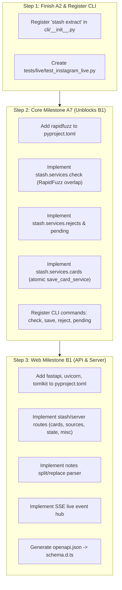

# Link Stash Progress Tracker & Spec Traceability

October 6, 2026 · Comprehensive Milestone Audit

---

## 1. Executive Summary & Dashboard

Link Stash is divided into two interdependent parts:
1. **Core Pipeline (Part 1, A-Series):** CLI, extractors, reel understanding engines, markdown card store, SQLite FTS5 index, inventory scanning, triage services, and portable agent skills.
2. **Library Web App (Part 2, B-Series):** Local single-page application (`apps/web`) served by `stash serve` (FastAPI), providing feed browsing, video playback, conflict-safe card editing, backlinks, graph visualization, and stash-specific views.

### Overall Completion Status

| Area | Milestones Defined | Completed / Substantially Done | Planned / In Progress | Completion % |
| --- | --- | --- | --- | --- |
| **Core Pipeline (A1–A10)** | 10 | 3 complete (A1, A3, A4) + 1 near-complete (A2) | 6 planned (A5, A6, A7, A8, A9, A10) | **48%** |
| **Web Application (B0–B6)** | 7 | 1 complete (B0 + interactive mocks) | 6 planned (B1–B6) | **22%** |
| **Combined System** | 17 | 4 complete/near-complete | 13 planned | **38%** |

### Automated Verification Scorecard

| Component | Test Suite | Pass Count | Lint Status | Typecheck Status | Build Status |
| --- | --- | --- | --- | --- | --- |
| **`apps/core` (Python 3.14)** | Pytest 9.1.1 (17 modules) | **115 / 115 passing** (100%) | Ruff: 0 errors | Pyright (strict): 0 errors | N/A (Python package) |
| **`apps/web` (React 19 / Vite)** | Vitest 5.0.3 (8 test files) | **51 / 51 passing** (100%) | ESLint: 0 errors | `tsc -b`: 0 errors | Vite build: **0.87 kB HTML, 335 kB JS, 52 kB CSS** |
| **Total Automated Tests** | Pytest + Vitest | **166 tests passing** | Clean | Strict clean | Production build clean |

---

## 2. Milestone-by-Milestone Progress Matrix

### Core Pipeline Milestones (A-Series)

| Milestone | Code | Spec Reference | Plan Document | Status | Test Coverage | Key Deliverables |
| --- | --- | --- | --- | --- | --- | --- |
| **A1 Scaffold** | `A1` | [link-stash-spec.md](file:///docs/link-stash-spec.md#L486) | [2026-10-05-core-a1-scaffold.md](file:///docs/superpowers/plans/2026-10-05-core-a1-scaffold.md) | **Complete (100%)** | 13 tests (`test_cli.py`, `test_config.py`) | `apps/core` uv project, `stash.config`, `stash.errors`, `stash doctor`, `.github/workflows/ci.yml`. |
| **A2 Instagram Extractor** | `A2` | [link-stash-spec.md](file:///docs/link-stash-spec.md#L141-L170) | [2026-10-05-core-a2-instagram.md](file:///docs/superpowers/plans/2026-10-05-core-a2-instagram.md) | **In Progress (~85%)** | 39 tests (`test_keys.py`, `test_instagram_parse.py`, `test_extract_service.py`) | Scrapling embed fetch, media download with resumability, CTA keyword detection, `failed.jsonl` error logging. Missing: CLI subcommand registration and 20-link live test. |
| **A3 Reel Engines** | `A3` | [link-stash-spec.md](file:///docs/link-stash-spec.md#L171-L235) | [2026-10-05-core-a3-reel-engines.md](file:///docs/superpowers/plans/2026-10-05-core-a3-reel-engines.md) | **Complete (100%)** | 41 tests (`test_reel_*.py`, `test_cli_reel.py`, `test_reel_live.py`) | `schemas/reel.json`, `prompt.md`, `agy` headless engine, `gemini_api` engine, `frames` fallback, `stash analyze`, `stash ingest`, Oct 5 test reels live verification. |
| **A4 Store and Index** | `A4` | [link-stash-spec.md](file:///docs/link-stash-spec.md#L324-L345) | [2026-10-05-core-a4-store-index.md](file:///docs/superpowers/plans/2026-10-05-core-a4-store-index.md) | **Complete (100%)** | 22 tests (`test_store_cards.py`, `test_store_index.py`, `test_store_lock.py`, `test_store_watcher.py`, `test_cli_store.py`) | Byte-identical card serialization, SHA-256 hash, reentrant write lock, SQLite index with 8 tables + FTS5 search, watchfiles watcher, `stash reindex`. |
| **A5 Other Extractors** | `A5` | [link-stash-spec.md](file:///docs/link-stash-spec.md#L141-L154) | [2026-10-05-core-a5-other-extractors.md](file:///docs/superpowers/plans/2026-10-05-core-a5-other-extractors.md) | **Planned (0%)** | 0 tests | GitHub dual-backend (API + scrape), Hugging Face hub, Notion, PDF, generic web, 1-level follow-through. |
| **A6 Inventory** | `A6` | [link-stash-spec.md](file:///docs/link-stash-spec.md#L236-L269) | [2026-10-05-core-a6-inventory.md](file:///docs/superpowers/plans/2026-10-05-core-a6-inventory.md) | **Planned (0%)** | 0 tests | Tool scanners (Claude, Antigravity, Codex, etc.), local models (Ollama, LM Studio, HF cache), `inventory/auto/` and `inventory/manual/`, `stash scan`, `stash have`. |
| **A7 Check, Save, Queue** | `A7` | [link-stash-spec.md](file:///docs/link-stash-spec.md#L366-L372) | [2026-10-05-core-a7-triage-save.md](file:///docs/superpowers/plans/2026-10-05-core-a7-triage-save.md) | **Planned (0%)** *(B1 Blocker)* | 0 tests | Exact dedup, RapidFuzz overlap ranking, `stash check`, `stash save`, `library/pending.md`, `library/rejected.md`, `stash import-ig-export`, `queue.md`. |
| **A8 Agent Skills** | `A8` | [link-stash-spec.md](file:///docs/link-stash-spec.md#L348-L408) | Planned | **Planned (0%)** | 0 tests | Portable `SKILL.md` files: `/stash`, `/stash-init`, `/stash-have`, `/stash-pending`, `/stash-scan`; `stash install-skills` junction/symlink installer. |
| **A9 Fallbacks** | `A9` | [link-stash-spec.md](file:///docs/link-stash-spec.md#L494) | Planned | **In Progress (~25%)** | 6 tests (`test_reel_frames.py`) | Contact sheet generator (`frames.py`) built; faster-whisper integration and yt-dlp burner cookie fallback pending. |
| **A10 First Real Run** | `A10` | [link-stash-spec.md](file:///docs/link-stash-spec.md#L495) | Planned | **Planned (0%)** | 0 tests | Full end-to-end user test with backlog import and initial manual inventory seeding. |

---

### Library Web App Milestones (B-Series)

| Milestone | Code | Spec Reference | Plan Document | Status | Test Coverage | Key Deliverables |
| --- | --- | --- | --- | --- | --- | --- |
| **B0 Visual Design** | `B0` | [library-app-spec.md](file:///docs/library-app-spec.md#L224-L232) | [2026-10-05-library-app-b0-design.md](file:///docs/superpowers/plans/2026-10-05-library-app-b0-design.md) | **Complete (100%)** | 51 tests | `tokens.css` with 0 hardcoded colors/px, WCAG AA contrast tests, system/manual theme toggle, `Tile`, `GeneratedTile`, `CategoryPill`, `SegmentedControl`, `StashLogo`, `MorphIcon`, mock feed, card, and interactive views. |
| **B1 Serve and API** | `B1` | [library-app-spec.md](file:///docs/library-app-spec.md#L170-L192) | [2026-10-05-library-app-b1-api.md](file:///docs/superpowers/plans/2026-10-05-library-app-b1-api.md) | **Planned (0%)** | 0 tests | `stash serve` FastAPI server, CRUD endpoints, Notes section parser/patcher, range-supported media streaming, watcher SSE events, OpenAPI TS types. |
| **B2 Shell, Grid, Search** | `B2` | [library-app-spec.md](file:///docs/library-app-spec.md#L59-L98) | [2026-10-05-library-app-b2-shell.md](file:///docs/superpowers/plans/2026-10-05-library-app-b2-shell.md) | **Planned (0%)** | 0 tests | TanStack Router, AppShell, sidebar/drawer, Lenis smooth scroll, shared virtualized grid, Feed/category/search routes, Ctrl+K palette, URL filters, live sync. |
| **B3 Card Page** | `B3` | [library-app-spec.md](file:///docs/library-app-spec.md#L126-L138) | [2026-10-05-library-app-b3-card.md](file:///docs/superpowers/plans/2026-10-05-library-app-b3-card.md) | **Planned (0%)** | 0 tests | `/c/$slug` route, read-only markdown body, CodeMirror 6 Notes editor with `[[slug]]` autocomplete, autosave with 409 conflict banner, Properties form with ChipInput, Reject dialog. |
| **B4 Stash Views** | `B4` | [library-app-spec.md](file:///docs/library-app-spec.md#L151-L158) | [2026-10-05-library-app-b4-stash-views.md](file:///docs/superpowers/plans/2026-10-05-library-app-b4-stash-views.md) | **Planned (0%)** *(Mocked in B0)* | 0 tests | Sources list + video player with seekable timestamp chips, Pending resolve form, Rejected table with un-reject, Inventory view, theSVG brand logos. |
| **B5 Backlinks and Graph** | `B5` | [library-app-spec.md](file:///docs/library-app-spec.md#L144-L150) | [2026-10-05-library-app-b5-graph.md](file:///docs/superpowers/plans/2026-10-05-library-app-b5-graph.md) | **Planned (0%)** *(Mocked in B0)* | 0 tests | Card link panels (backlinks, mentions, outgoing), sigma.js WebGL graph visualization with ForceAtlas2 worker, 1/2 hop local graph, global `/graph`. |
| **B6 Polish Pass** | `B6` | [library-app-spec.md](file:///docs/library-app-spec.md#L228-L232) | [2026-10-05-library-app-b6-polish.md](file:///docs/superpowers/plans/2026-10-05-library-app-b6-polish.md) | **Planned (15%)** | 3 tests (`MorphIcon.test.tsx`) | Shared View Transitions, Motion layout animations, torph text morphs, theme cord, and the 4 quality gate checks. `MorphIcon` is already implemented. |

---

## 3. Core Contract Compliance Matrix

The Core Contract defined in [2026-10-05-library-app-00-overview.md](file:///docs/superpowers/plans/2026-10-05-library-app-00-overview.md#L22-L100) specifies exact types, functions, and interfaces shared between the Core pipeline and the FastAPI backend.

| Contract Element | Expected Location | Implementation Status | Notes |
| --- | --- | --- | --- |
| `Config`, `load_config` | `stash.config` | **Complete** | In [config.py](file:///apps/core/src/stash/config.py). Supports `home`, `port`, `category_colors`, `web_dist`. |
| `StashError`, `NotFound`, `Conflict`, `Invalid`, `LockTimeout` | `stash.errors` | **Complete** | In [errors.py](file:///apps/core/src/stash/errors.py). All error codes and `to_dict()` formatting match spec. |
| `SEED_CATEGORIES`, `Kind`, `Card` | `stash.store.models` | **Complete** | In [models.py](file:///apps/core/src/stash/store/models.py). Strict Pydantic models with `schema` alias. |
| `Mention`, `SourceDoc` | `stash.store.models` | **Complete** | In [models.py](file:///apps/core/src/stash/store/models.py). Field types and defaults match contract. |
| `PendingItem`, `RejectEntry`, `InventoryEntry` | `stash.store.models` | **Complete** | In [models.py](file:///apps/core/src/stash/store/models.py). Defined per contract. |
| `card_path`, `parse_card`, `render_card` | `stash.store.cards` | **Complete** | In [cards.py](file:///apps/core/src/stash/store/cards.py). Byte-identical round-trip verified. |
| `content_hash`, `write_atomic`, `save_card` | `stash.store.cards` | **Complete** | In [cards.py](file:///apps/core/src/stash/store/cards.py). Atomic write with temp-rename and index update. |
| `write_lock` | `stash.store.lock` | **Complete** | In [lock.py](file:///apps/core/src/stash/store/lock.py). In-process reentrant with 30s timeout. |
| `connect`, `rebuild`, `reindex_path`, `remove_path` | `stash.store.index` | **Complete** | In [index.py](file:///apps/core/src/stash/store/index.py). SQLite WAL mode, schema versioning, FTS5 table. |
| `read_source`, `write_source` | `stash.store.sources` | **Complete** | In [sources.py](file:///apps/core/src/stash/store/sources.py). Writes `source.md` and `raw.json`. |
| `watch` | `stash.store.watcher` | **Complete** | In [watcher.py](file:///apps/core/src/stash/store/watcher.py). Async generator using `watchfiles`. |
| `add_reject`, `remove_reject` | `stash.services.rejects` | **Pending (A7)** | Not implemented yet. File does not exist. |
| `list_pending`, `add_pending`, `resolve_pending` | `stash.services.pending` | **Pending (A7)** | Not implemented yet. File does not exist. |
| `have` | `stash.services.inventory` | **Pending (A6)** | Not implemented yet. File does not exist. |
| `app` (Typer CLI) | `stash.cli:app` | **Partially Complete** | In [cli/__init__.py](file:///apps/core/src/stash/cli/__init__.py). `doctor`, `analyze`, `ingest`, `reindex` registered. |

---

## 4. Detailed Component & Subsystem Audit

### A. Extractors & Reel Understanding

| Component | Target File | Implemented Symbols / Features | Missing / Pending Work | Status |
| --- | --- | --- | --- | --- |
| **Instagram Extractor** | `stash/extract/instagram.py` | `parse_embed`, `detect_cta`, `IgRecord`, `MediaItem` | None for parsing logic. | **100% Done** |
| **Instagram Service** | `stash/services/extract.py` | `extract`, `fetch_embed`, `_download`, `_extract_one`, `failed_urls`, batching, jitter | Needs integration with A5 multi-extractor router. | **90% Done** |
| **Reel Models & Schema** | `stash/reel/models.py`, `schemas/reel.json` | `ReelRecord`, `ReelMention`, `ReelCta`, JSON schema | None. | **100% Done** |
| **Reel System Prompt** | `stash/reel/prompt.md` | Mention rules, feature nesting rules, takeaway rules | None. | **100% Done** |
| **Antigravity Headless** | `stash/reel/agy.py` | `run_agy_headless`, process spawn, structured output | None. | **100% Done** |
| **Gemini API Engine** | `stash/reel/gemini_api.py` | `run_gemini_api`, inline (<20MB), Files API (>=20MB) | `google-genai` needs to be added to `pyproject.toml` dependencies. | **95% Done** |
| **Frames Engine** | `stash/reel/frames.py` | `generate_contact_sheet`, ffmpeg scene change detection | Whisper transcription integration (A9). | **75% Done** |
| **Reel Service** | `stash/services/reel.py` | `analyze_reel`, `ingest_reel`, engine fallback chain, cache | None. | **100% Done** |
| **GitHub Extractor** | `stash/extract/github.py` | None | API and scrape dual backend (A5). | **0% Done** |
| **Hugging Face Extractor** | `stash/extract/hf.py` | None | Hub metadata and GGUF detection (A5). | **0% Done** |
| **Notion Extractor** | `stash/extract/notion.py` | None | Public page scraper and markdown converter (A5). | **0% Done** |
| **PDF Extractor** | `stash/extract/pdf.py` | None | PyMuPDF text and link extractor (A5). | **0% Done** |
| **Generic Web Extractor** | `stash/extract/web.py` | None | Scrapling readability extractor (A5). | **0% Done** |
| **IG Backlog Importer** | `stash/extract/ig_export.py` | None | `saved_posts.json` backlog parser (A7). | **0% Done** |

### B. Storage, Indexing & Concurrency

| Component | Target File | Implemented Symbols / Features | Verification / Evidence | Status |
| --- | --- | --- | --- | --- |
| **Card Serialization** | `stash/store/cards.py` | `card_path`, `parse_card`, `render_card`, `content_hash`, `write_atomic`, `save_card` | `test_store_cards.py` proves byte-identical round-trip and hash stability. | **100% Done** |
| **Reentrant File Lock** | `stash/store/lock.py` | `write_lock`, thread-local depth tracking, 30s timeout, `LockTimeout` | `test_store_lock.py` verifies reentrancy, contention timeout, and recovery. | **100% Done** |
| **SQLite Schema & FTS5** | `stash/store/index.py` | `cards`, `sources`, `links`, `tags`, `inventory`, `rejects`, `pending`, `search` (FTS5) tables, WAL mode | `test_store_index.py` verifies WAL pragma, table creation, and rebuild. | **100% Done** |
| **Path Reindexing** | `stash/store/index.py` | `reindex_path`, `remove_path`, `rebuild`, wikilink extractor | `test_store_index.py` verifies roundtrip indexing and query restoration. | **100% Done** |
| **Sources Store** | `stash/store/sources.py` | `read_source`, `write_source`, `append_failed` | Serializes YAML frontmatter + caption body cleanly. | **100% Done** |
| **Filesystem Watcher** | `stash/store/watcher.py` | `watch`, watchfiles iterator, temp file exclusion | `test_store_watcher.py` verifies batching and temp file ignoring. | **100% Done** |

### C. CLI Subcommands Audit

The specification ([docs/link-stash-spec.md](file:///docs/link-stash-spec.md#L360-L376)) calls for 13 subcommands:

| Subcommand | Purpose | Implementation Status | File Location |
| --- | --- | --- | --- |
| `stash doctor` | Check environment, paths, tools on PATH | **Implemented** | [cli/__init__.py](file:///apps/core/src/stash/cli/__init__.py#L37) |
| `stash extract` | Extract links into sources | **Pending CLI registration** | Logic in [services/extract.py](file:///apps/core/src/stash/services/extract.py), needs Typer hookup |
| `stash analyze` | Analyze reel via LLM engines | **Implemented** | [cli/reel.py](file:///apps/core/src/stash/cli/reel.py#L26) |
| `stash ingest` | Ingest engine output from stdin/file | **Implemented** | [cli/reel.py](file:///apps/core/src/stash/cli/reel.py#L44) |
| `stash reindex` | Rebuild SQLite index from markdown | **Implemented** | [cli/store.py](file:///apps/core/src/stash/cli/store.py#L26) |
| `stash scan` | Inventory auto-rescan | **Not implemented** | Part of Milestone A6 |
| `stash have` | Add manual inventory entry | **Not implemented** | Part of Milestone A6 |
| `stash check` | Dedup & overlap candidate scoring | **Not implemented** | Part of Milestone A7 |
| `stash save` | Atomic card save & indexing | **Not implemented** | Part of Milestone A7 |
| `stash reject` | Record rejection in `rejected.md` | **Not implemented** | Part of Milestone A7 |
| `stash pending` | List, add, resolve pending items | **Not implemented** | Part of Milestone A7 |
| `stash import-ig-export` | Import Instagram backlog | **Not implemented** | Part of Milestone A7 |
| `stash queue` | Inspect or pop triage queue | **Not implemented** | Part of Milestone A7 |
| `stash serve` | FastAPI backend & static server | **Not implemented** | Part of Milestone B1 |
| `stash install-skills` | Link skills to Claude/Antigravity | **Not implemented** | Part of Milestone A8 |

### D. Agent Skills Audit

The specification ([docs/link-stash-spec.md](file:///docs/link-stash-spec.md#L350-L359)) requires 5 portable agent skills:

| Skill | Trigger / Command | CLI Calls Invoked | Implementation Status |
| --- | --- | --- | --- |
| **`/stash`** | Main triage workflow | `scan --if-stale`, `queue next`, `extract`, `analyze`/`ingest`, `check`, `save`, `reject`, `pending add` | **Not Started** (Milestone A8) |
| **`/stash-init`** | Guided inventory onboarding | `have` (repeated) | **Not Started** (Milestone A8) |
| **`/stash-have`** | Quick inventory insertion | `have` | **Not Started** (Milestone A8) |
| **`/stash-pending`** | View & resolve DM link requests | `pending list`, `pending resolve` | **Not Started** (Milestone A8) |
| **`/stash-scan`** | Force refresh inventory | `scan` | **Not Started** (Milestone A8) |

---

## 5. Web Application Architecture Audit (`apps/web`)

### Implemented Components & Structure

```
apps/web/src/
├── styles/
│   ├── tokens.css               <- 100% compliant token system (light + dark, seed categories, type, radius)
│   └── tokens.test.ts           <- Automated WCAG AA contrast & token verification (24 tests)
├── components/
│   ├── CategoryPill.tsx         <- Category color badge
│   ├── GeneratedTile.tsx        <- Fallback tile with category tint & kind icon
│   ├── Tile.tsx                 <- Primary 4:5 card thumbnail tile
│   └── ui/
│       ├── button.tsx           <- Radix button primitive
│       ├── input.tsx            <- Text input primitive
│       ├── separator.tsx        <- Separator primitive
│       ├── tooltip.tsx          <- Tooltip primitive
│       ├── MorphIcon.tsx        <- Morphicons wrapper with spring physics
│       ├── SegmentedControl.tsx <- Apple-grade animated segmented switcher
│       └── StashLogo.tsx        <- SVG logo with size & responsive variants
├── state/
│   └── theme.tsx                <- React context with system preference & manual toggle
├── mock/
│   ├── mock-data.ts             <- Fixture items covering all 9 kinds
│   ├── MockCard.tsx             <- Full desktop/mobile responsive card view
│   ├── MockFeed.tsx             <- Responsive virtualized grid mock with day grouping
│   └── MockViews.tsx            <- Mocks for Sources, Pending, Rejected, Inventory, Graph
└── App.tsx                      <- Full interactive shell integrating all views with hash routing
```

### Web Milestone Gaps (B1–B6)

1. **B1 FastAPI Server & Client:**
   - Need `apps/core/src/stash/server/` with routes: `cards.py`, `sources.py`, `state.py`, `misc.py`.
   - Need `apps/core/src/stash/store/notes.py` (split and replace notes section).
   - Need `apps/core/src/stash/services/library.py` (cursor pagination, FTS formatting).
   - Need `apps/core/src/stash/server/events.py` (SSE live events hub).
   - Need `openapi-typescript` generation script producing `apps/web/src/api/schema.d.ts`.
2. **B2 App Shell & Live Grid:**
   - Need TanStack Router integration (`src/routes/`).
   - Need TanStack Query integration (`src/api/client.ts`).
   - Need TanStack Virtual shared grid (`VirtualGrid.tsx`).
   - Need Lenis smooth scrolling wrapper (`MainScroll.tsx`).
   - Need Ctrl+K Command Palette with FTS5 highlight markups.
3. **B3 Card Editing:**
   - Need CodeMirror 6 markdown editor with debounced autosave.
   - Need 409 conflict reconciliation banner ("Reload from disk" vs "Keep mine").
   - Need `PropertiesForm.tsx` with `ChipInput.tsx` for tags.
4. **B4 Stash Views:**
   - Live HTML5 video player with seekable timestamp chips (`MM:SS`).
   - Live Pending resolution form (`POST /api/pending/{id}/resolve`).
   - Live Inventory tool grouping.
5. **B5 Graph:**
   - sigma.js WebGL renderer + `graphology`.
   - ForceAtlas2 layout executing inside a dedicated Web Worker.
6. **B6 Polish:**
   - Native View Transitions API for Tile -> Card shared morph.
   - Motion presence and grid reordering animations.

---

## 6. Dependencies & Toolchain Status

### Python Environment (`apps/core/pyproject.toml`)

- **Installed & Verified:** `typer`, `pydantic`, `httpx`, `scrapling[fetchers]`, `watchfiles`, `pyyaml`, `pymupdf`, `huggingface-hub`, `pytest`, `ruff`, `pyright`.
- **Missing Dependencies to Add:**
  - `rapidfuzz` (Required for A7 check & overlap scoring).
  - `fastapi`, `uvicorn`, `tomlkit` (Required for B1 API server).
  - `google-genai` (Required for live Gemini API reel analysis).
  - `faster-whisper` (Required for A9 audio transcription fallback).

### Node.js Environment (`apps/web/package.json`)

- **Installed & Verified:** React 19, Vite 8, Tailwind CSS v4, `@fontsource-variable/geist`, `@hugeicons/react`, `radix-ui`, `morphicons`, `culori`, Vitest 5, ESLint 10, Prettier.
- **Dependencies to Add for B1–B5:**
  - `@tanstack/react-router`, `@tanstack/react-query`, `@tanstack/react-virtual`
  - `openapi-fetch`, `openapi-typescript` (dev)
  - `lenis`
  - `@codemirror/view`, `@codemirror/state`, `@codemirror/lang-markdown`, `@codemirror/autocomplete`
  - `react-markdown`
  - `sigma`, `graphology`, `graphology-layout-forceatlas2`
  - `motion`

### Monorepo & Pre-commit Hooks

- Root `package.json` with Husky + `lint-staged` is not yet configured.
- Recommended to configure Husky running `ruff check` on staged `.py` and `eslint` on staged `.tsx`.

---

## 7. Immediate Next Steps & Critical Path



1. **Step 1 (Immediate Polish):** Expose `stash extract` on the CLI app in [apps/core/src/stash/cli/__init__.py](file:///apps/core/src/stash/cli/__init__.py) and add CLI tests to complete Milestone A2.
2. **Step 2 (Critical Dependency for B1):** Implement Milestone A7 ([2026-10-05-core-a7-triage-save.md](file:///docs/superpowers/plans/2026-10-05-core-a7-triage-save.md)). This delivers the final service functions (`check`, `save`, `rejects`, `pending`) required by the FastAPI server routes.
3. **Step 3 (Full API Server):** Implement Milestone B1 ([2026-10-05-library-app-b1-api.md](file:///docs/superpowers/plans/2026-10-05-library-app-b1-api.md)), bringing up `stash serve` with real SQLite queries, range-based video streaming, and SSE event dispatching.
4. **Step 4 (Remaining Core Milestones):** Execute A5 (Other extractors: GitHub, HF, Notion, PDF), A6 (Inventory scanners), and A8 (Portable Agent Skills).
